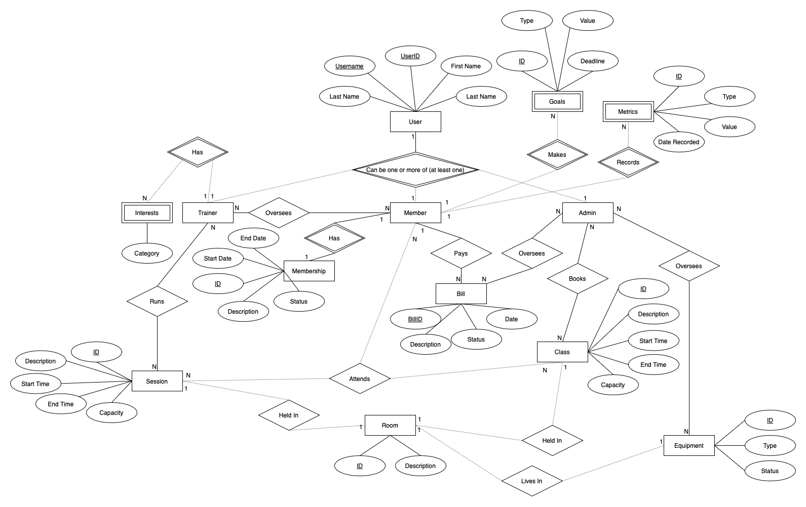
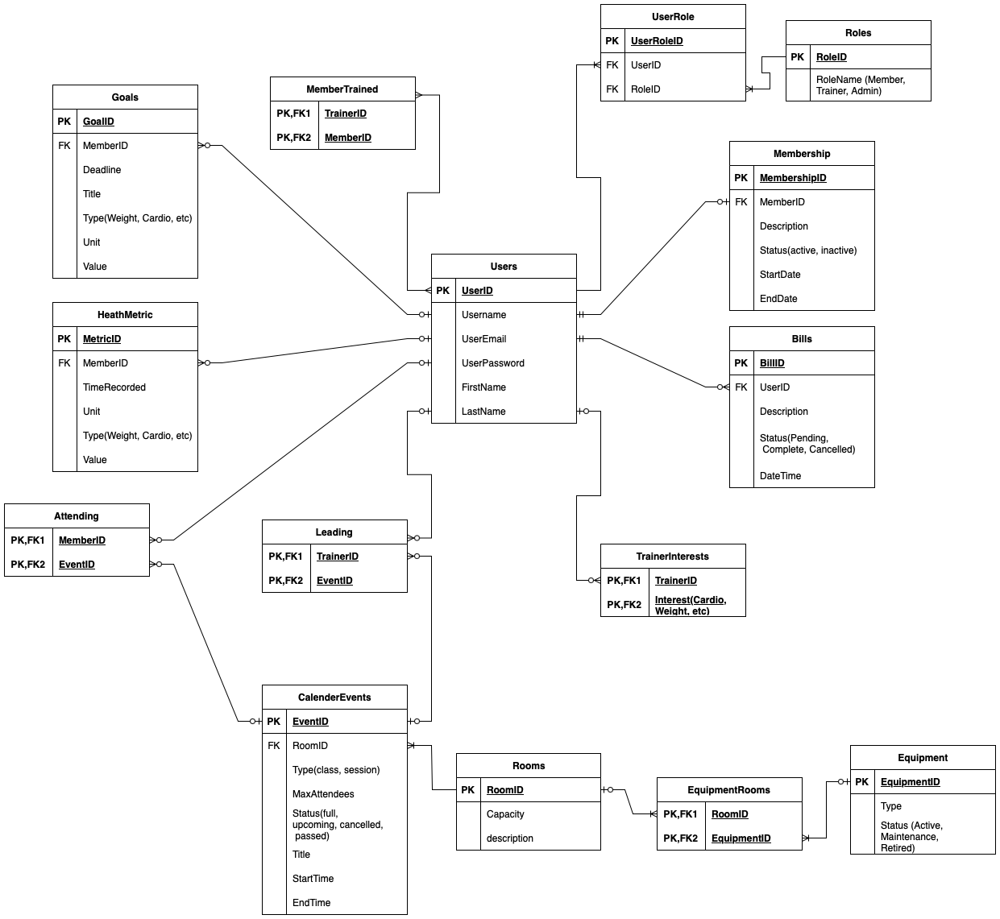

# Health and Fitness Management System: Final Project for COMP3005

This project was created for COMP3005: Database Management Systems. It is a web backend that simulates a fitness management system for a gym, and allows members, trainers, and admins to engage with gym amenities.

It is created in [Go](https://go.dev) using [GraphQL](https://graphql.org) with the [gqlgen](https://github.com/99designs/gqlgen) tool, [JWT](https://jwt.io), and [sqlc](https://github.com/sqlc-dev/sqlc).

Watch the video demo [here](https://youtu.be/3BMdiW5DC30)

## Entity Relation Diagram

## Relational Schema

## About the folders

>[!Warning]
>This codebase suffers from a deeply-flawed-and-not-very-successful attempt at code organization and trying new things...

**server/api/graph:** GraphQL related files including schema and resolvers

**server/api/middleware:** Middleware (related to authentication and authorization in this case)

**server/api/rest:** REST endpoints for authentication

**server/core:** the application interfaces and types that the API and DB folders rely on

**server/db/connect:** Database connection file for Postgres

**server/db/migrations:** Database migrations (fulfils the DDL requirement in the assignment specification)

**server/db/pg:** Files related to querying and interacting with Postgres. Any files ending in `*.sql.go` are generated by `sqlc`. Other files are implementations of the core interfaces for Postgres.

**server/db/queries:** SQL queries and seed data for the database.

**server/services:** Various functions that act as the go-between for the interfaces and repositories 

## Running the code

(This assumes you have Go setup)

1. Create a `.env` file at the root of the directory. Put your own postgres URI into this .env with `DATABASE_URL="your-uri"` and create also insert `JWT_SECRET="secret"`

2. Setup the database with `golang-migrate` by running the necessary `up` commands and insert the seed data.

3. In the command line, run `cd ./server`

4. Run `go mod tidy` to install dependencies.

5. Run `go run main.go server.go` to compile and run the code in one step. Alternatively, compile the code with `go build` and run the executable.

